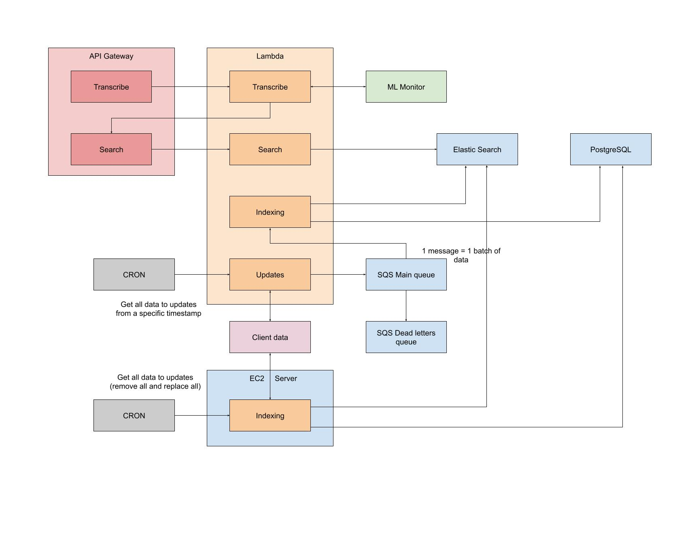
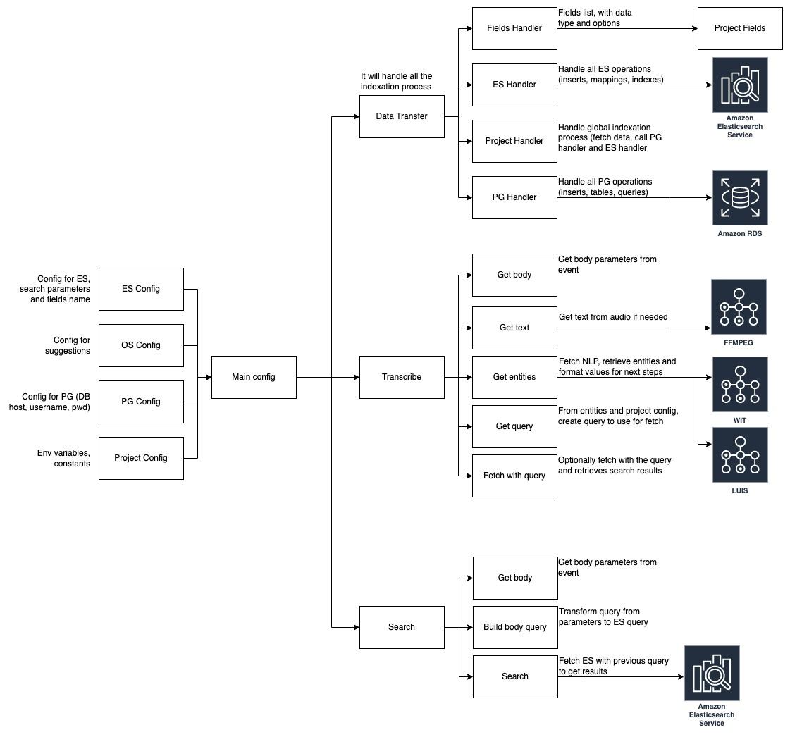
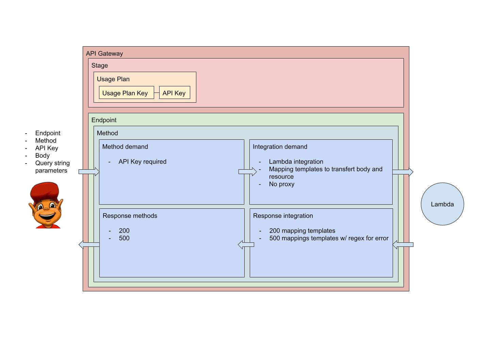

# Introduction

* The great principales to build a new API:
	* create the indexation to understand the data
		* fetch the data
		* analyse the content
		* create fields
	* create search and transcribe functions
		* create the config to fit API needs
			* create esParameters mappings
			* select fields that can be used as strict match(terms)
		* call functions from FW with the config in parameter
* create the API and the API keys + link endpoints to API lambdas
* create Postman monitor if needed


# Base Setup

## Indexes names

First, the indexes names need to be set:

```javascript
const tablesNamesES = {
	properties: "biens"
}
```


<hr>

## Fields names
```javascript
const esParameters = {
	keywords: "mots_cles",
	location: "localisation"
}
```

<hr>


## Basic structure

All the config is dedicated to a specific index, and the index name is got from `tablesNamesES` object:

```javascript
const esIndexes = {
	[tablesNameES.properties]: {
		FIELD_NAME: {
			correctTypes: [ ... ],
			defaultValue: ...,
			options: { ... },
			min: ...,
			max: ...,
			correctParameters: {
				ATTRIBUTE: {
					correctTypes: [ ... ],
					correctValues: [ ... ],
					defaultValue: ...,
					options: { ... },
					min: ...,
					max: ...,
				}
			}
		}
	}
}
```

`ATTRIBUTE` is the attribute that can be passed to the `FIELD_NAME`.

For example, `FIELD_NAME` can be:
- `keywords`
- `terms`
- `subfields`
- `location`

`correctParameters` is used for objects fields.

`correctTypes` is used for the values type, it can be one of the following:

- `boolean`
- `string`
- `number`
- `object`
- `array`

`min` and `max` options are used for `number` values.

If `array` is selected, it will check if all the array items fit the other types requirements.

`terms` is used for match against data fields (for example here `status`, or `price`).

Instead of using directly a name like `"location"`, please use `[esParameters.location]` as key for the config, in order to handle translations and renaming.


# Terms structure

The `terms` config is used for queries agains data fields.

`keys` will contain each field that can be used as queries.

`options` will contain all fields options for specific use.

```javascript
const esIndexes = {
	[tablesNameES.properties]: {
		terms: {
			keys: [ ... ],
			options: { ... }
		}
	}
}
```

At the root object, we can the option `mustBetweenTerms: true` to add a must between queries, if multiple queries are passed.

```javascript
const esIndexes = {
	[tablesNameES.properties]: {
		terms: {
			mustBetweenTerms: true,
			keys: [ ... ],
			options: { ... }
		}
	}
}
```


# Terms examples

## Basic numeric field

To initialize a numeric field:

```javascript
const esIndexes = {
	[tablesNameES.properties]: {
		terms: {
			keys: [ esParameters.price ],
			options: {
				[esParameters.price]: {
					correctTypes: [ "numbers", "string" ]
				}
			}
		}
	}
}
```

We can send a query like:

```javascript
{
	price: 100000
}
```

And get all the data where `status` is equal to `Available`.

The `options` object will specify **exact match** for data result (needed with string queries).

As numeric field, we can send min / max objects:

```javascript
{
	price: {
		min: 100000,
		max: 200000
	}
}
```


<hr>


## Basic string field

To initialize a string field for exact match:

```javascript
const esIndexes = {
	[tablesNameES.properties]: {
		terms: {
			keys: [ esParameters.status ],
			options: {
				[esParameters.status]: {
					correctTypes: [ "string" ],
					options: {
						strict: true
					}
				}
			}
		}
	}
}
```

We can send a query like:

```javascript
{
	status: "Active"
}
```
And get all the data where `status` is equal to `Available`.

The `options` object will specify **exact match** for data result (needed with string queries).

<hr>


## Basic array of string

To allow arrays of string, we just need to add "array" in correctTypes.

*(OR condition will be used and test if each element is one of the correctTypes)*

```javascript
const esIndexes = {
   [tablesNameES.properties]: {
		terms: {
			keys: [ esParameters.status ],
			options: {
				[esParameters.status]: {
					correctTypes: [ "string", "array" ],
					options: {
						strict: true
					}
				}
			}
		}
	}
}
```

We can send a query like:
```javascript
{
	status: [ "Active", "Available" ]
}
```
And get all data where the status is `Active` **OR** `Available`.

<hr>


## Basic array of string + default value

Default values can be used in order to query specific items:

```javascript
const esIndexes = {
	[tablesNameES.properties]: {
		terms: {
			keys: [ esParameters.status ],
			options: {
				[esParameters.status]: {
					correctTypes: [ "string", "array" ],
					defaultValue: {
						value: "Available"
					},
					options: {
						strict: true
					}
				}
			}
		}
	}
}
```

We can send an empty query, and get all data where the status is `Available`.

<hr>


## Array of string + default values

Default values can be used in order to query specific items:

```javascript
const esIndexes = {
	[tablesNameES.properties]: {
		terms: {
			keys: [ esParameters.status ],
			options: {
				[esParameters.status]: {
					correctTypes: [ "string", "array" ],
					defaultValue: {
						value: [ "Available", "Active" ]
					},
					options: {
						strict: true
					}
				}
			}
		}
	}
}
```

We can send an empty query, and get all data where the status is `Available` **OR** `Active`.

<hr>


## Array of string + advanced default values

Default values can be set with options, such as `operand`, that will update the kind of query:

```javascript
const esIndexes = {
	[tablesNameES.properties]: {
		terms: {
			keys: [ esParameters.status ],
			options: {
				[esParameters.status]: {
					correctTypes: [ "string", "array" ],
					defaultValue: {
						operand: "not",
						value: [
							"Vendu",
							"Compromis",
							"Suspendu",
						]
					},
					options: {
						strict: true
					}
				}
			}
		}
	}
}
```

We can send an empty query, and get all data where the status is **NOT** `Vendu` **NOR** `Compromis` **NOR** `Suspendu`.

<hr>


## Advanced example

For nested objects, we can add `notIncludedInES`.

It will prevent the search against that field.

In order to have a search againsit fields that are included in `location`, we can add a `fields` parameter to list all the searchable fields.

```javascript
const esIndexes = {
	[tablesNameES.properties]: {
		terms: {
			keys: [ esParameters.location ],
			options: {
				[esParameters.location]: {
					notIncludedInES: true,
					shouldBetweenTerms: true,
					fields: [
						esParameters.zipCode,
						esParameters.cityName,
						esParameters.departmentName,
						esParameters.regionName
					]
				}
			}
		}
	}
}
```

We can send a query like:

```javascript
{
	location: {
		zip_code: 14000
	}
}
```

A `shouldBetweenTerms` parameter can be set in order to get a logical OR between terms.

```javascript
const esIndexes = {
	[tablesNameES.properties]: {
		terms: {
			keys: [ esParameters.location ],
			options: {
				[esParameters.location]: {
					notIncludedInES: true,
					shouldBetweenTerms: true,
					fields: [
						esParameters.zipCode,
						esParameters.cityName,
						esParameters.departmentName,
						esParameters.regionName
					]
				}
			}
		}
	}
}
```

We can send a query like:

```javascript
{
	location: {
		zip_code: 14000,
		city_name: "Saint Aubin Sur mer"
	}
}
```

It will return all the data with `"14000"` as `zip_code`, **OR** `"Saint Aubin Sur mer"` as `city_name`.

Additionnal options can be passed to fields that are nested.

For example, the `location` field is a nested object with a `zip_code` field.

A `strict` option can be used to get an exact match aganst the `zip_code` value.

```javascript
const esIndexes = {
	[tablesNameES.properties]: {
		terms: {
			keys: [ esParameters.location ],
			options: {
				[esParameters.location]: {
					notIncludedInES: true,
					shouldBetweenTerms: true,
					fields: [
						esParameters.zipCode,
						esParameters.cityName,
						esParameters.departmentName,
						esParameters.regionName
					]
				},
				zip_code: {
					strict: true
				}
			}
		}
	}
}
```

To override the default query used to trigger Elasticsearch database, we can add a `query` option (default is `term`).

```javascript
const esIndexes = {
	[tablesNameES.properties]: {
		terms: {
			keys: [ esParameters.location ],
			options: {
				[esParameters.location]: {
					notIncludedInES: true,
					shouldBetweenTerms: true,
					fields: [
						esParameters.zipCode,
						esParameters.cityName,
						esParameters.departmentName,
						esParameters.regionName
					]
				},
				zip_code: {
					strict: true,
					query: "terms"
				}
			}
		}
	}
}
```

# From and size

The `from` and `size` parameters are used for pagination.

The `from` value will fix from wich element we'll send the results.

The `size` value if for the number of elements in the results.

```javascript
from: {
	correctTypes: [ "string", "number" ]
}
```

```javascript
size: {
	correctTypes: [ "string", "number" ]
}
```

We can then send queries like:
```javascript
{
	from: 100,
	size: 100
}

```


# Sort

## Basic structure

The `sort` parameter is used for sorting results.

The basic structure is:

```javascript
const esIndexes = {
	[tablesNameES.properties]: {
		[esParameters.sort]: {
			correctTypes: [ "object", "array" ],
			correctParameters: {
				attribute: {
					correctTypes: [ "string" ]
				},
				order: {
					correctTypes: [ "string" ],
					correctValues: [ "asc", "desc" ],
					defaultValue: "desc"
				}
			}
		}
	}
}
```

We can then send queries like:
```javascript
sort: {
	attribute: "price",
	order: "asc"
}
```

<hr>

## Script parameter

The `script` parameter allow the query to contain a painless script, in order to sort results from data values.


```javascript
const esIndexes = {
	[tablesNameES.properties]: {
		[esParameters.sort]: {
			correctTypes: [ "object", "array" ],
			correctParameters: {
				script: {
					correctTypes: [ "object" ]
				}
			}
		}
	}
}
```

For example, to sort accordingly to the `exclusif` value in the results, we can do the following:

```javascript
sort: {
	script: {
		lang: "painless",
		inline: "_score * (doc['exclusivif'].value * 5 + 1)"
	}
}
```

This is some **fine art** to get the item result, and multiply it by a factor that depends on the exclusivity value (0 or 1).

*Some people get hired at Nasa for less than that.*


# Location

## Basic structure
The `location` object contains all the location queries.

The `correctParameters` for the ocation queries can be one of the following:

- `travel_time`
- `starting_coord`
- `starting_city`
- `bound_box`
- `polygons`
- `zip_code`
- `city_name`
- `city_name_with_zip`
- `city_name_and_around`
- `departement_name`
- `departement_code`
- `region_name`
- `region_new_name`

Thus, the main structure for the location config is the following:

```javascript
const esIndexes = {
	[tablesNameES.properties]: {
		[esParameters.location]: {
			correctTypes: [ "object", "array" ],
			correctParameters: { ... }
		}
	}
}
```

<hr>


## Gauss parameter

The `gauss` parameter is used for the locatlisation functon.

The config is as follow:

```javascript
{
	scale: "5km",
	offset: "1km",
	decay: 0.7
};
```

The `scale` parameter represents the for how much distance as unit of decrease.

The `offset` parameter represents an offset from which we'll start the decrease.

The `decay` parameter is a factor to decrease the item score.

For example:

- an item has a score of `100`
- it is located at `7km` from the requested point
- with the config the final score will be `70`

<hr>


## Travel time

The `travel time` query needs a field name in order to select on which field the query will be run against:

```javascript
const esIndexes = {
	[tablesNameES.properties]: {
		[esParameters.location]: {
			correctTypes: [ "object", "array" ],
			correctParameters: {
				[esParameters.travelTime]: {
					field: "itemLocation",
					correctTypes: [ "object", "array" ],
					correctParameters: { ... }
				}
			}
		}
	}
}
```

We can send multiple parameters from the following:

- `mode`
- `travel`
- `traffic`
- `routeWeights`
- `quality`
- `range`
- `rangeType`
- `coordinates`
- `startingCity`

*The following code examples will be inside `correctParameters`*

The `mode` parameter is for the transport mode (5 in total).

```javascript
[esParameters.mode]: {
	correctTypes: [ "string" ],
	correctValues: [
		esParameters.car,
		esParameters.pedestrian,
		esParameters.publicTransport,
		esParameters.bike,
		esParameters.truck
	]
}
```

The `travel` parameter is for the travel method (3 in total):

```javascript
[esParameters.travel]: {
	correctTypes: [ "string" ],
	correctValues: [
		esParameters.shortest,
		esParameters.fastest,
		esParameters.default
	]
}
```

```javascript
[esParameters.traffic]: {
	correctTypes: [ "string", "boolean" ],
	correctValues: [ "true", "false" ]
},
```

The `routeWeights` parameter allow the sender to add weights on the routes (`0` = default, `-3` = avoid as much as possible).

```javascript
[esParameters.routeWeights]: {
	correctTypes: [ "object" ],
	correctParameters: {
		[esParameters.tollroad]: {
			correctTypes: [ "string", "number" ],
			correctValues: [ "0", "-1", "-2", "-3" ]
		},
		[esParameters.motorway]: {
			correctTypes: [ "string", "number" ],
			correctValues: [ "0", "-1", "-2", "-3" ]
		},
		[esParameters.boatFerry]: {
			correctTypes: [ "string", "number" ],
			correctValues: [ "0", "-1", "-2", "-3" ]
		},
		[esParameters.railFerry]: {
			correctTypes: [ "string", "number" ],
			correctValues: [ "0", "-1", "-2", "-3" ]
		},
		[esParameters.tunnel]: {
			correctTypes: [ "string", "number" ],
			correctValues: [ "0", "-1", "-2", "-3" ]
		},
		[esParameters.dirtRoad]: {
			correctTypes: [ "string", "number" ],
			correctValues: [ "0", "-1", "-2", "-3" ]
		},
		[esParameters.park]: {
			correctTypes: [ "string", "number" ],
			correctValues: [ "0", "-1", "-2", "-3" ]
		}
	}
}
```

The `quality` parameter is used for the isoline shape quality.

The higher the value, the better the quality is but longer will be the calculation.

```javascript
[esParameters.quality]: {
	correctTypes: [ "string", "number" ],
	correctValues: [ "1", "2", "3" ]
},
```

The `rangeType` parameter is used as range value, as distance or time.

The maximum is `32400`.

```javascript
[esParameters.range]: {
	correctTypes: [ "number" ],
	max: 32400
}
```

The `rangeType` parameter is used with the `range` parameter.

It will defin de type of value that `range` will represent (`distance in meters`, or `time in seconds`).

```javascript
[esParameters.rangeType]: {
	correctTypes: [ "string" ],
	correctValues: [
		esParameters.distance,
		esParameters.time
	]
}
```

As starting point, we can set `coordinates` or `startingCity`.

`coordinates` can be sent as `string`, `array of points` or `object with lat and lon`.

```javascript
[esParameters.coordinates]: {
	correctTypes: [ "string", "array", "object" ],
	correctParameters: {
		lat: {
			correctTypes: [ "number", "string" ]
		},
		lon: {
			correctTypes: [ "number", "string" ]
		}
	}
}
```

For example:

```javascript
{
	...,
	coordinates: "49.1846358,-0.4072621"
}

{
	...,
	coordinates: ["49.1846358", "-0.4072621"]
}

{
	...,
	coordinates: {
		lat: "49.1846358",
		lon: "-0.4072621"
	}
}
```

The other starting option can be `startingCity`.

The string will be geolocalized, and the coordinates will be used as starting point.

```javascript
[esParameters.startingCity]: {
	correctTypes: [ "string", "array" ]
}
```

<hr>


## Starting coordinates

The `startingCoordinates` option is used to get all items from one point.

The more they are close to this point, the sooner they will appear in the results.

```javascript
const esIndexes = {
	[tablesNameES.properties]: {
		[esParameters.location]: {
			correctTypes: [ "object", "array" ],
			correctParameters: {
				[esParameters.startingCoordinates]: {
					fields: [ "itemLocation" ]
					coordinates: {
						correctTypes: [ "string", "array", "object" ],
						correctParameters: {
							lat: {
								correctTypes: [ "number", "string" ]
							},
							lon: {
								correctTypes: [ "number", "string" ]
							}
						}
					},
				}
			}
		}
	}
}
```

We can send a query like:

```javascript
{
	starting_coordinates: "49.1846358,-0.4072621"
}

{
	starting_coordinates: ["49.1846358", "-0.4072621"]
}

{
	starting_coordinates: {
		lat: "49.1846358",
		lon: "-0.4072621"
	}
}
```

<hr>

## Starting city

The same logic as in `startingCoordinates` is applied with the `startingCity`.

The more they are close to the geolocalized point from the city name, the sooner they will appear in the results.

```javascript
const esIndexes = {
	[tablesNameES.properties]: {
		[esParameters.location]: {
			correctTypes: [ "object", "array" ],
			correctParameters: {
				[esParameters.startingCity]: {
					correctTypes: [ "string", "array" ]
				}
			}
		}
	}
}
```

We can send a query like:

```javascript
{
	starting_city: "Caen"
}
```

<hr>


## Bound box

The `boundBox` option is used for queries with `east`, `west`, `north`, and `south` values (for examples with maps that send the four values, in order to get results inside that map).

The four points (`NE`, `NW`, `SE`, `SW`) will be construct with these values.

```javascript
const esIndexes = {
	[tablesNameES.properties]: {
		[esParameters.location]: {
			correctTypes: [ "object" ],
			correctParameters: {
				[esParameters.boundBox]: {
					correctTypes: [ "object" ],
					correctParameters: {
							[esParameters.east]: {
								correctTypes: [ "number", "string" ]
							},
							[esParameters.west]: {
								correctTypes: [ "number", "string" ]
							},
							[esParameters.north]: {
								correctTypes: [ "number", "string" ]
							},
							[esParameters.south]: {
								correctTypes: [ "number", "string" ]
							}
						}
					}
				}
			}
		}
	}
};
```

We can send a query like:

```javascript
{
	bound_box: {
		"east": 2.157515186732553,
		"west": 1.410444874232553,
		"north": 49.21119368510827,
		"south": 48.40081833276716
	}
}
```

<hr>


## Polygons

The `points` option can be used to get items inside a polygon made with several polygons.

One polygon is a list of points.

`points` can handle an array of polygons.

The structure is as following:

```javascript
[
	[
		{ ... },
		{ ... },
		{ ... }
	],
	[
		{ ... },
		{ ... },
		{ ... }
	]
]
```

The correct settings are simple, but must includes `objetc` and `array` as correct type.

```javascript
const esIndexes = {
	[tablesNameES.properties]: {
		[esParameters.location]: {
			correctTypes: [ "object" ],
			correctParameters: {
				[esParameters.polygons]: {
					correctTypes: [ "object", "array" ],
					correctParameters: {
						lat: {
							correctTypes: [ "number", "string" ]
						},
						lon: {
							correctTypes: [ "number", "string" ]
						}
					}
				}
			}
		}
	}
}
```

# Associations

```javascript
const associations = {
	zip_code: [
		[ "75016", "75116" ]
	]
};
```

# Synonyms

```javascript
const synonyms = {
	type_bien: {
		Maison: [
			"Maison",
			"Villa"
		],
		Appartement: [
			"Appartement",
			"Loft",
			"Marina"
		],
		Commerce: [
			"Fond de commerce",
			"Local Commercial",
			"local commercial"
		],
		Bureau: [
			"Bureaux"
		]
	}
}
```

# Settings

```javascript
{
	settings: {
		analysis: {
			filter: {
				french_elision: {
					type: "elision",
					articles_case: true,
					articles: [
						"l", "m", "t", "qu", "n", "s",
						"j", "d", "c", "jusqu", "quoiqu",
						"lorsqu", "puisqu"
					]
				},
				french_stop: {
					type: "stop",
					stopwords: "_french_"
				},
				french_stemmer: {
					type: "stemmer",
					language: "light_french"
				},
				...s
			},
			tokenizer: {
				location_tokenizer: {
					type: "pattern",
					pattern: "[^a-zA-Z0-9-]+"
				}
			},
			analyzer: {
				french: {
					tokenizer: "icu_tokenizer",
					filter: [ ...filters ]
				},
				location_analyzer: {
					type: "custom",
					tokenizer: "location_tokenizer"
				}
			}
		}
	},
	max_result_window: 100000
}
```


# Schema

## General structure



<hr>


## API FW architecture



<hr>


# API Gateway

## API Gateway architecture



<hr>

## Method Request

The `API Key REquired` must be set to `true`

<hr>


## Integration Request

Choose the corect lambda function to call.

It must be called **without** `Use Lambda Proxy integration`.


The content type is `application/json`.

The mapping templates should be as follow:

```json
{
	"body": $input.json('$'),
	"resource": "$context.resourcePath",
	"queryStringParameters": {
        #foreach($param in $input.params().querystring.keySet())
            "$param": "$util.escapeJavaScript($input.params().querystring.get($param))" #if($foreach.hasNext),#end
        #end
   }
}
```

<hr>


## Method Responses

Before setting up the `Integration Responses`, you need to configure the `Method Responses`.

Configure the correct `HTTP Status`:

- 200
- 500

<hr>


## Integration Responses

- Default
	- Lambda Error Regex: -
	- Method response stauts: 200
	- Content handling: Passthrough
	- Mapping templates:
		- content type: application/json
		- template:
			```json
			$input.path("$.body")
			```

- Error
	- Lambda Error Regex: Error.*
	- Method response stauts: 500
	- Content handling: Passthrough
	- Mapping templates:
		- content type: application/json
		- template:
			```json
			{ "error" : true, "message": $input.json("$.errorMessage") }
			```